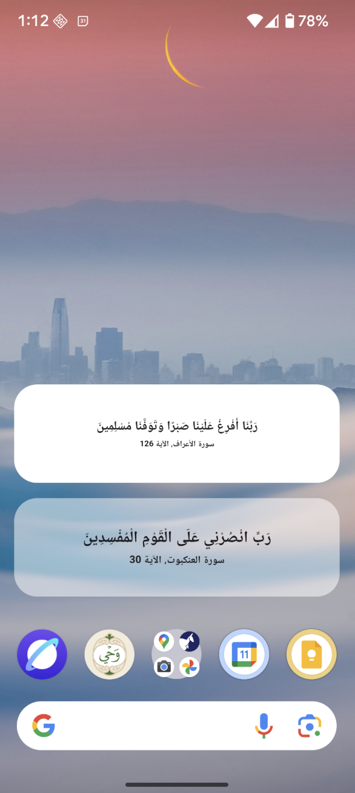
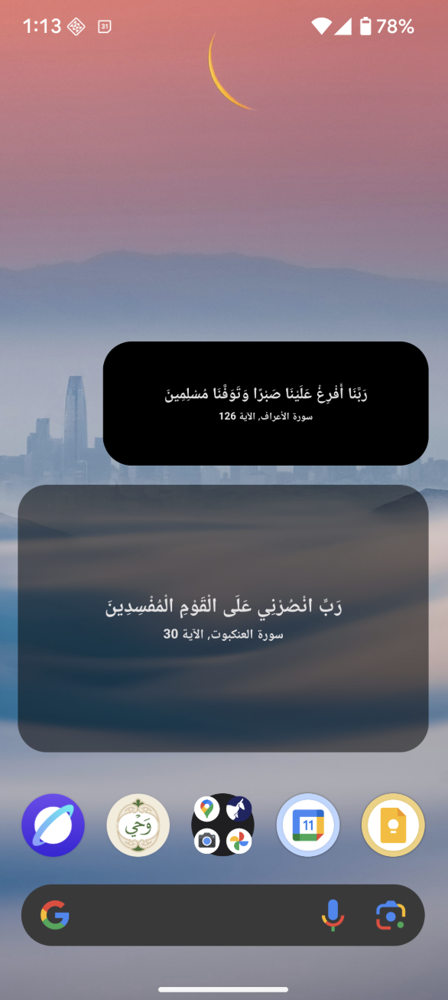
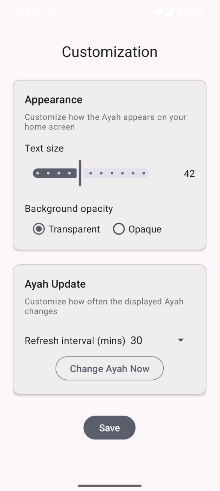

عرض آيات من القرآن الكريم بشكل دوري على الشاشة الرئيسية

Displays a periodically refreshed Quran Ayah as a home screen widget

<table border="0">
    <tr border="0">
        <td></td>
        <td></td>
        <td></td>
    </tr>
</table>
